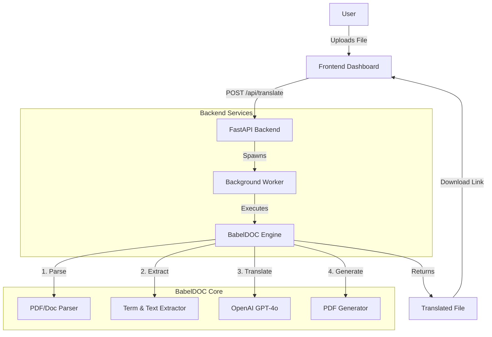

# Babel

<div align="center">
  
  <br>
  <h1>Translate Books Brilliantly</h1>
  <br>
  <div align="center">
    
    &nbsp;&nbsp;&nbsp;&nbsp;
    
    &nbsp;&nbsp;&nbsp;&nbsp;
    
    &nbsp;&nbsp;&nbsp;&nbsp;
    <span style="font-size: 20px; font-weight: bold; font-family: sans-serif; vertical-align: top;">Antigravity</span>
    &nbsp;&nbsp;&nbsp;&nbsp;
    
    &nbsp;&nbsp;&nbsp;&nbsp;
    
  </div>
</div>

<div align="center">
  
</div>

---

## 🌍 Augmenting Human Intelligence

In an era where information is abundant but often siloed by language, **Babel** stands as a bridge. We believe that knowledge should be universally accessible, regardless of the language it was originally written in.

Babel is not just a translation tool; it is a **human augmentation system**. By leveraging state-of-the-art Generative AI, we empower individuals to tap into vast knowledge reservoirs that were previously out of reach. Whether it's technical documentation, literary masterpieces, or academic research, Babel ensures that language is no longer a barrier to understanding.

## 🚀 Mission

Our mission is to democratize access to global knowledge. We are building a future where:
- **Language is fluid**: Ideas flow freely across linguistic borders.
- **Knowledge is universal**: Every human has the right and ability to learn from the collective wisdom of the world.
- **Potential is unleashed**: By removing language constraints, we unlock the full creative and intellectual potential of humanity.

## 🤝 Collaboration & Partners

Babel is the result of a visionary collaboration led by **LunarTech**. We have partnered with industry leaders to build a robust, scalable, and intelligent system.

| **LunarTech** | **Google** | **OpenAI** | **BabelDOC** |
| :---: | :---: | :---: | :---: |
|  | **Cloud & Infrastructure** | **LLM Intelligence** | **Core Engine** |

> "Collaboration is the essence of innovation. Together, we are redefining what is possible in the realm of cross-lingual communication."

## ✨ Key Features

- **Context-Aware Translation**: Understands the nuance and context of entire documents, not just isolated sentences.
- **Preserves Formatting**: Maintains the original layout, styling, and structure of your documents.
- **Multi-Format Support**: Seamlessly handles PDF, DOCX, and other major document formats.
- **Powered by GenAI**: Utilizes the latest advancements in Large Language Models for unmatched accuracy.

## 🔄 How It Works

Babel streamlines the translation process into a simple, intuitive flow:

1.  **Upload**: Drag and drop your document (PDF, DOCX) into the Babel dashboard.
2.  **Select Language**: Choose your desired target language from our supported list.
3.  **Translate**: Our AI engine analyzes the document structure, extracts text, and translates it while preserving context and formatting.
4.  **Download**: Receive your perfectly translated document, ready for immediate use.

## 🏗️ System Architecture

Babel is built on a modern, decoupled architecture designed for performance and scalability.



### Component Interaction
1.  **Frontend (Dashboard)**: A responsive web interface built with HTML/CSS/JS that handles file uploads and status polling.
2.  **Backend (FastAPI)**: A high-performance Python server that manages jobs, handles file I/O, and orchestrates the translation process.
3.  **BabelDOC Engine**: The core intelligence layer that processes documents. It runs as a subprocess to ensure isolation and stability.

## 🧠 Under the Hood: BabelDOC

BabelDOC is the engine that powers our high-fidelity translations. Unlike standard translation tools that treat text as a flat string, BabelDOC understands **document structure**.

### The Pipeline
1.  **Layout Analysis**: BabelDOC first analyzes the PDF layout to understand headers, footers, columns, and images.
2.  **Term Extraction**: Before translating, it extracts key terminology to ensure consistency across the entire document.
3.  **Contextual Translation**: Text is grouped into logical blocks (paragraphs) and sent to the LLM (GPT-4o) with context, ensuring that "bank" is translated correctly whether it refers to a river or money.
4.  **Reconstruction**: The translated text is injected back into the original layout, preserving fonts, styles, and positioning.

## 🛠️ Technical Setup

To run the Babel server locally, follow these steps:

### Prerequisites
- Python 3.8+ installed
- OpenAI API Key

### Installation & Startup

1.  **Navigate to the backend directory**:
    ```bash
    cd handex-backend-antigravity
    ```

2.  **Install dependencies**:
    ```bash
    pip install fastapi uvicorn python-multipart openai
    ```

3.  **Set your API Key**:
    ```bash
    # Windows (PowerShell)
    $env:OPENAI_API_KEY="your-api-key-here"
    
    # Mac/Linux
    export OPENAI_API_KEY="your-api-key-here"
    ```

4.  **Start the Server**:
    ```bash
    python server.py
    ```

5.  **Access the Application**:
    Open your browser and navigate to: [http://localhost:8000/dashboard/index.html](http://localhost:8000/dashboard/index.html)

---

<div align="center">
  <sub>Built with ❤️ by LunarTech</sub>
</div>
